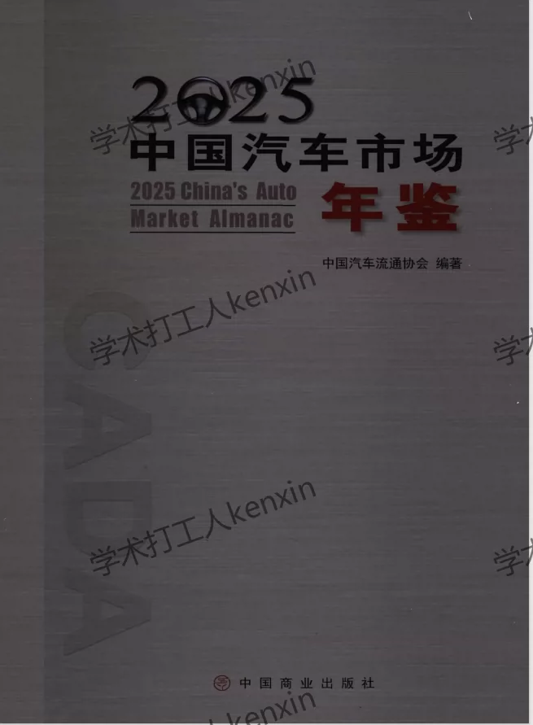
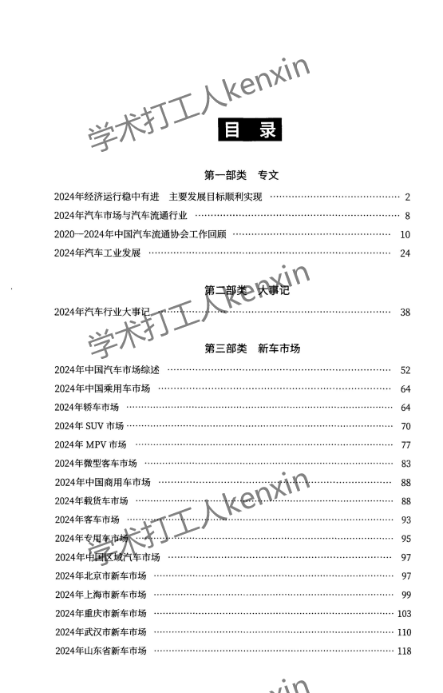
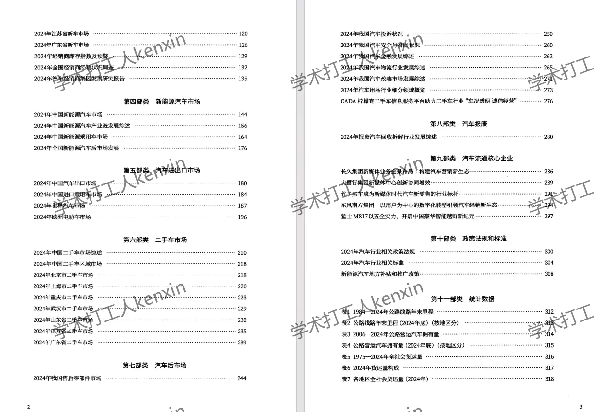
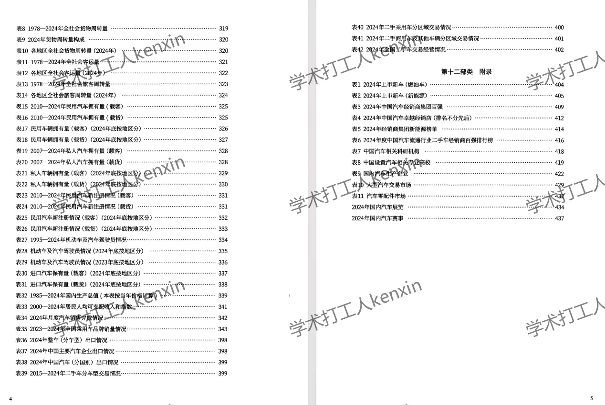
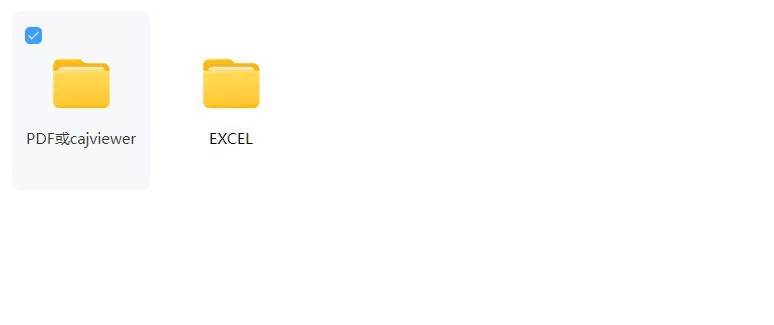
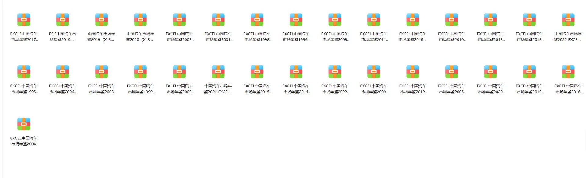
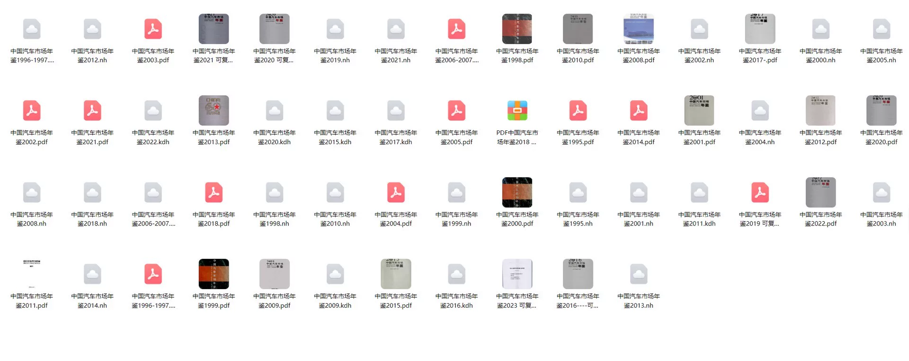

## Body

"China Automobile Market Annual" (1995-2025)

Data Year: The yearbook covers the years 1995 to 2025.

01. Data Introduction
"China Automobile Market Annual"

02. Indicator Details
The directory is displayed in the image, please view it on your own and consider purchasing. I cannot help you find data for indicators; all information is here. After shipment, there is no right of return without reason.
The display directory is for the year 2025. The statistical methods may change from year to year. Academic common sense, the yearbook records data for the previous year is also a fact of academic common sense, please be aware.

03. Data Content
Format: For the years 2024 and 2025, it will be PDF format. For others, it can be PDF, Excel, CAJViewer, or all three. Please make sure before you purchase, if you are not okay with the format, do not buy.

## Images

item_981142900588

Here is a pay link on Stripe ( https://buy.stripe.com/3cs8yP7sY87d0vu9AB ). Please contact me lonlonago@foxmail.com after funding $89, and I will send you a complete data files , thank you!

